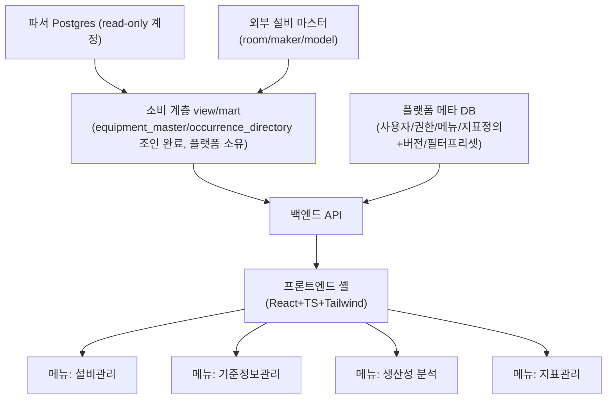

# 01. 전체 아키텍처 및 파서-플랫폼 데이터 계약 (백엔드/인프라 담당자용)

## 전체 아키텍처

API가 파서 원본 테이블을 직접 참조하지 않고 소비 계층(view/mart)을 거치는 이유는 단순히 컬럼명 변경 흡수만이 아니다. 이 계층은 두 종류로 나눠야 한다:

1. 컬럼 rename 같은 파서 쪽 변경을 흡수하는 **얇은 호환 뷰**
2. 성능·지연 재계산을 위한 **materialized mart**(`docs/23`이 전제하는 파이프라인)

두 계층은 갱신 모델이 다르다. mart가 `equipment_master`/`occurrence_directory`/`(equipment_id, anchor)` 조인을 미리 끝내면 API는 이미 조인된 결과만 읽는다.

## 파서-플랫폼 데이터 계약 리스크

`SnapshotSchema.CurrentVersion`은 CarryOver Snapshot DTO 직렬화 버전이지 DB 스키마 계약 전체의 버전이 아니다(DB 마이그레이션은 별도 DbUp journal이 관리). 다음 다섯 가지를 구분해야 한다:

- DB 구조·마이그레이션 이력
- 파서 로직 버전과 데이터 생성 시점
- Snapshot 직렬화 버전
- 플랫폼이 소비하는 분석 계약 버전
- 지표 정의 버전

실제로 파서 저장소는 컬럼/테이블을 계속 변경해왔다(예: `PortId` → `ModuleIsPort` 트리플릿 — `context_recognized_parser` `docs/09` §8.2 + `docs/22` §1.1, lot/job 등 13개 테이블 컬럼 rename — 같은 레포 `docs/11` §14.1, 둘 다 완료됨). 컬럼명 변경은 View에서 흡수하기 쉽지만, 의미 변경·grain 변경·신규 필드의 과거값 부재(`docs/23` §2.5: DDL에 컬럼이 있어도 값이 안 들어오는 경우)나 관계 변경까지 View가 자동으로 해결하지는 못한다. 같은 API 필드명을 유지한 채 의미만 달라지는 경우가 오히려 더 위험하다.

**주의(2차 리뷰에서 발견)**: 파서 레포의 `docs/23` §2.5 자체가 일부 stale하다 — "anchor rename 구현 대기"라는 서술은 실제로는 이미 완료됐다(진실은 `docs/11` §14.1). `docs/23`의 SQL 예시를 그대로 베끼지 말고, 컬럼명 계약은 항상 파서 레포의 `docs/11` §14.1 / `docs/09` §8.2 / `docs/22` §1.1(최신 필드 사전)을 기준으로 삼을 것.

### 대응

얇은 호환 뷰(rename 흡수)와 성능·지연 재계산을 위한 materialized mart를 같은 계층으로 뭉뚱그리지 않는다. 소비 계층 테이블(`equipment_master`/`occurrence_directory`/mart)은 플랫폼(소비 계층)이 소유하고 마이그레이션도 플랫폼이 관리한다(`docs/23` §0 원칙). 분석 계약에는 컬럼명뿐 아니라 식별 키, grain, 단위, 시각 의미, null 의미, 품질 필드, 지원 원천 버전까지 포함하고, 파서 스키마 버전이 오를 때마다 실제 dump 기반 fixture로 뷰·계약 스냅샷 테스트를 돌린다. 테스트 없는 View 계층은 "흡수한다"는 선언일 뿐 보장이 아니다.

### mart 재계산 트리거 (2차 리뷰 보강)

재계산 트리거는 지연 완료뿐 아니라 다음도 포함해야 한다:

- 마스터 소급 정정 (설비 속성이 뒤늦게 수정됨)
- 설비 재분류 (`module_class_map` 갱신)
- 지표 정의 변경

여러 mart를 읽는 화면의 차트·표·CSV가 서로 다른 갱신 세대를 섞지 않도록 계산 기준시각을 함께 관리해야 한다. `pg_cron`은 실행 스케줄일 뿐 이 정합성을 대신 보장하지 않는다 — watermark 감지(열린 anchor 해소 감지) → 대상 구간 재집계 메커니즘이 별도로 필요하다.

### 집계 가능성 계약

지표 정의에는 재집계 규칙이 필요하다. 설비별 P95를 평균해 전체 P95로 만들거나, 일별 점유율을 단순 평균하는 구현을 막아야 한다 — 비율 지표는 분자·분모를 각각 합산해서 계산한다. 화면 해상도용 다운샘플링과 지표 계산도 구분해야 한다.

### 마스터 데이터 수정 권한의 원천 (2차 리뷰 보강)

아키텍처에는 외부 마스터(room/maker/model)가 있고, `02_domain_menus.md`의 설비관리 메뉴에는 플랫폼 속성 수정이 있다. 같은 필드를 양쪽이 수정하면 다음 import가 운영자의 변경을 덮어쓸 수 있다. 필드별 원천 소유자(외부 동기화 전용 / 플랫폼 직접관리)를 Phase 0에서 명확히 구분해야 한다. "사용중지"와 속성 이력의 `valid_to` 종료도 동일한 의미로 처리하지 않는다.

## 멀티테넌시/확장성

멀티테넌시는 Open Question(→ `05_roadmap_and_open_questions.md`)으로 미룬다. 초기엔 풀 멀티테넌시(테넌트별 스키마/DB)보다 단일 테넌트 + 모든 분석 grain에 site/plant 차원을 넣는 행 스코핑이 가장 싼 미래호환 설계다. RLS(Row Level Security) 도입은 실제 요구가 생길 때.

확장성에서는 프레임워크보다 한 요청이 읽는 행 수와 반환하는 점 수가 중요하다. 초기 설계에 조회 기간·반환량 제한, SQL timeout, 장기 작업의 비동기 실행, 서버 집계·다운샘플링을 포함할 것.
