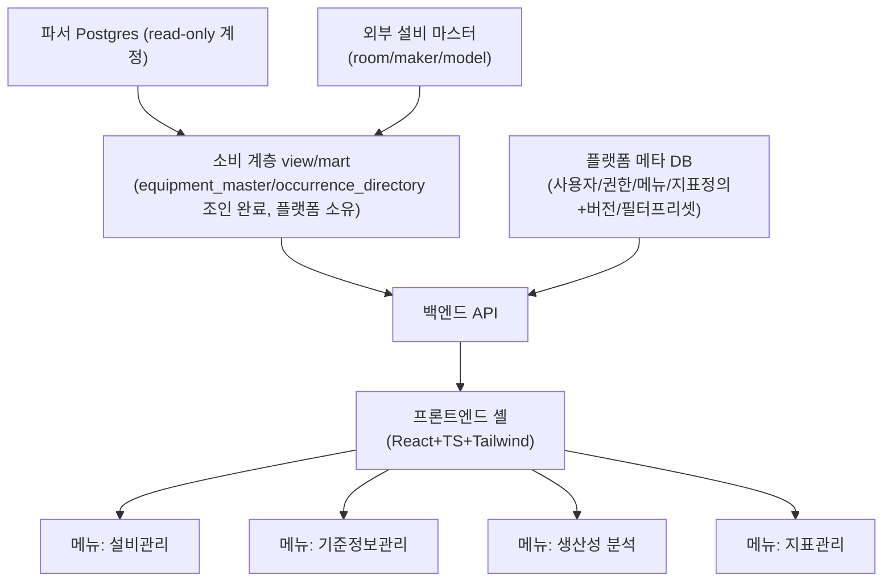

# 01. 전체 아키텍처 및 파서-플랫폼 데이터 계약 (백엔드/인프라 담당자용)

## 전체 아키텍처

API가 파서 원본 테이블을 직접 참조하지 않고 소비 계층(view/mart)을 거치는 이유는 단순히 컬럼명 변경 흡수만이 아니다. 이 계층은 두 종류로 나눠야 한다:

1. 컬럼 rename 같은 파서 쪽 변경을 흡수하는 **얇은 호환 뷰**
2. 성능·지연 재계산을 위한 **materialized mart**(`docs/23`이 전제하는 파이프라인)

두 계층은 갱신 모델이 다르다. mart가 `equipment_master`/`occurrence_directory`/`(equipment_id, anchor)` 조인을 미리 끝내면 API는 이미 조인된 결과만 읽는다.

## 파서-플랫폼 데이터 계약 리스크

`SnapshotSchema.CurrentVersion`은 CarryOver Snapshot DTO 직렬화 버전이지 DB 스키마 계약 전체의 버전이 아니다(DB 마이그레이션은 별도 DbUp journal이 관리). 다음 다섯 가지를 구분해야 한다:

- DB 구조·마이그레이션 이력
- 파서 로직 버전과 데이터 생성 시점
- Snapshot 직렬화 버전
- 플랫폼이 소비하는 분석 계약 버전
- 지표 정의 버전

실제로 파서 저장소는 컬럼/테이블을 계속 변경해왔다(예: `PortId` → `ModuleIsPort` 트리플릿 — `context_recognized_parser` `docs/09` §8.2 + `docs/22` §1.1, lot/job 등 13개 테이블 컬럼 rename — 같은 레포 `docs/11` §14.1, 둘 다 완료됨). 컬럼명 변경은 View에서 흡수하기 쉽지만, 의미 변경·grain 변경·신규 필드의 과거값 부재(`docs/23` §2.5: DDL에 컬럼이 있어도 값이 안 들어오는 경우)나 관계 변경까지 View가 자동으로 해결하지는 못한다. 같은 API 필드명을 유지한 채 의미만 달라지는 경우가 오히려 더 위험하다.

**주의(2차 리뷰에서 발견)**: 파서 레포의 `docs/23` §2.5 자체가 일부 stale하다 — "anchor rename 구현 대기"라는 서술은 실제로는 이미 완료됐다(진실은 `docs/11` §14.1). `docs/23`의 SQL 예시를 그대로 베끼지 말고, 컬럼명 계약은 항상 파서 레포의 `docs/11` §14.1 / `docs/09` §8.2 / `docs/22` §1.1(최신 필드 사전)을 기준으로 삼을 것.

### 대응

얇은 호환 뷰(rename 흡수)와 성능·지연 재계산을 위한 materialized mart를 같은 계층으로 뭉뚱그리지 않는다. 소비 계층 테이블(`equipment_master`/`occurrence_directory`/mart)은 플랫폼(소비 계층)이 소유하고 마이그레이션도 플랫폼이 관리한다(`docs/23` §0 원칙). 분석 계약에는 컬럼명뿐 아니라 식별 키, grain, 단위, 시각 의미, null 의미, 품질 필드, 지원 원천 버전까지 포함하고, 파서 스키마 버전이 오를 때마다 실제 dump 기반 fixture로 뷰·계약 스냅샷 테스트를 돌린다. 테스트 없는 View 계층은 "흡수한다"는 선언일 뿐 보장이 아니다.

### mart 재계산 트리거 (2차 리뷰 보강)

재계산 트리거는 지연 완료뿐 아니라 다음도 포함해야 한다:

- 마스터 소급 정정 (설비 속성이 뒤늦게 수정됨)
- 설비 재분류 (`module_class_map` 갱신)
- 지표 정의 변경

여러 mart를 읽는 화면의 차트·표·CSV가 서로 다른 갱신 세대를 섞지 않도록 계산 기준시각을 함께 관리해야 한다. `pg_cron`은 실행 스케줄일 뿐 이 정합성을 대신 보장하지 않는다 — watermark 감지(열린 anchor 해소 감지) → 대상 구간 재집계 메커니즘이 별도로 필요하다.

**CFG 관련 Open / 경계(2026-09-24):** CFG는 설비 단위 기록이며 Module 대상은 값 내부 속성이지 CFG 테이블의 분할 키가 아니다. 분석에 필요한 유효값은 Job 시작 시점 값으로 충분하다([CONTEXT](../CONTEXT.md)). CFG 의존 지표가 정해지면 설정 변경/정정이 어떤 mart 재계산을 요구하는지 별도로 명세한다. 이번 결정으로 새 자동 재계산 트리거를 채택하지 않으며, CFG cross-menu 연계는 [06 §22](06_platform_ui_contract.md#22-cross-menu-context-link)의 Deferred를 유지한다.

### 집계 가능성 계약

지표 정의에는 재집계 규칙이 필요하다. 설비별 P95를 평균해 전체 P95로 만들거나, 일별 점유율을 단순 평균하는 구현을 막아야 한다 — 비율 지표는 분자·분모를 각각 합산해서 계산한다. 화면 해상도용 다운샘플링과 지표 계산도 구분해야 한다.

### 마스터 데이터 수정 권한의 원천 (2차 리뷰 보강)

아키텍처에는 외부 마스터(room/maker/model)가 있고, `02_domain_menus.md`의 설비관리 메뉴에는 플랫폼 속성 수정이 있다. 같은 필드를 양쪽이 수정하면 다음 import가 운영자의 변경을 덮어쓸 수 있다. 필드별 원천 소유자(외부 동기화 전용 / 플랫폼 직접관리)를 구현 전에 명확히 구분해야 한다. 과거 Phase 0 표기는 [05의 Deferred 가설](05_roadmap_and_open_questions.md#deferred--과거-phase-roadmap-가설-non-authoritative)을 가리키며 승인된 일정이 아니다. 설비의 사용중지는 해당 ID 이력의 `valid_to` 종료와 같은 사건이다(2026-09-24 정정). EquipmentName 변경으로 새 ID를 재등록하면 기존 ID 종료가 곧 사용중지이며 이후 다른 용도로 재사용하지 않는다. room_name의 드문 변경은 같은 ID를 유지한다([CONTEXT](../CONTEXT.md), [09](09_equipment_master_wireframe.md)).

## 데이터 운영 정책

이 절은 폴링·파서 DB 접근·지연완료 정책의 상세 원본이다. 05는 결정 상태와 과거 위치 안내를 유지한다. Decided는 구현 완료가 아니며 각 문단의 Candidate/Open을 별도로 따른다.

### 실시간성 (Decided — 메커니즘)

기본은 **폴링 + 서버가 제공하는 완료된 계산 세대/갱신 정보 기반 캐시 재검증**이다. 원천 watermark 이동을 mart 재집계 완료와 같다고 보지 않는다(감지→재계산→정합 결과 제공을 구분). 웹소켓/SSE는 열린 대시보드의 초 단위 갱신, 또는 동시 편집 presence가 **문서화된 제품 요구**로 확인될 때 재평가한다(이 두 조건만이 영구 유일하다고 못박지 않는다). 클라이언트 폴링 주기는 **5분(300s)으로 확정**(2026-09-22, 필요시 조정 가능한 값으로 취급). 폴링 중단 조건·워커 감지 주기의 숫자는 여전히 Open이다(운영 설정으로 구현 시점에 정함, 이번 세션에서 grilling하지 않음). 근거: `docs/reviews/2026-09-18-url-time-status-contract-grilling.md` §6.1.

### 파서 DB 접근 방식 (Decided — 메커니즘)

"직접 연결 vs read replica"를 **mart 소스 인스턴스가 어디에 사는가**의 문제로 재정의한다. **기본 정책은 같은 Postgres 인스턴스, 파서 read-only 역할, 플랫폼 전용 스키마다**(`03_backend_stack.md`가 이미 추천했던 토폴로지를 이 세션에서 기본값으로 확정). API는 파서 원본 테이블을 직접 조회하지 않는다(`01_architecture_and_data_contract.md`). replica/분리 인스턴스는 쓰기 경합 또는 보안 격리 요구가 **실제로 확인될 때만** 평가 대상으로 승격한다(경합 존재만으로 자동 승격하지 않는다). 근거: `docs/reviews/2026-09-18-url-time-status-contract-grilling.md` §6.2.

### 지연 완료 허용 시간 (Decided — 정책 메커니즘 + 구체 숫자)

> **원본·변경 영향:** 이 절이 R/H·지연완료 자동 재집계 정책을 소유한다. [06 시간 계약](06_platform_ui_contract.md#ctx-time)은 기본 조회 상한과 R을 대조한다. 이 문서의 [mart 재계산 트리거](#mart-재계산-트리거-2차-리뷰-보강)·[실시간성](#refresh-policy), [03 시간 요약](03_backend_stack.md), [02 소비 기능](02_domain_menus.md), [REQUIREMENTS §6](../PLATFORM_REQUIREMENTS.md#6-기타-제안-위-5개-범위-밖-플랫폼이-메뉴-없이도-실패하는-지점)을 함께 검토한다. 조회 기간·표시가 바뀌면 06의 소비자 경로까지 따른다. `lateArrivalAutoHorizon`, `autoRefreshClosed`, 원천 진행 경계/자동 창을 검색해 추가 영향을 작업 기록에 남긴다.

필수 운영 설정 `lateArrivalAutoHorizon`(Candidate 이름) 없이는 자동 재집계를 시작하지 않는다(0이나 무한을 암묵값으로 넣지 않고, 숫자 미정이면 "설정 미충족"으로 보고한다). 창 **안**의 지연완료는 자동 재집계하고, 창 **밖**은 자동 재개방하지도 조용히 버리지도 않으며 식별·조회 가능한 정정/backfill 후보로 남겨 운영자가 명시적으로 실행한다(새 승인 워크플로 UI는 이번에 만들지 않음; 기존 플랫폼 권한·감사를 적용). `autoRefreshClosed`는 자동 창이 닫혔다는 뜻일 뿐 데이터가 완전/불변이라는 뜻이 아니다. 마스터 소급·재분류·지표 정의 변경은 이 창과 다른 트리거다.

창의 기준은 시간역별 **원천 진행 경계 `R`**(데이터 계층 소유, naive 배타 경계, 첫 mart 세대 생성 전에도 공급 가능하며 mart 계산 완료 시각·클라이언트 now·UTC 절단과는 다른 값)과 **명시적 wall-clock 길이 설정 `H`**다. 자동 창은 `[R-H, R)`이고, 원천 진행이 멈추면 창도 멈춘다(현실 경과일로 반드시 닫히는 것이 아니라 데이터 진행 기준의 창이다). `R`이 없으면 자동 재집계만 보류하며 지연완료 식별·후보 보존은 계속한다. 사업장 override·지표별 horizon은 수요·모델이 확인되기 전에는 구현하지 않는다(영구 금지와는 다르다). 근거: `docs/reviews/2026-09-18-url-time-status-contract-grilling.md` §6.3.

`H`=**1시간**으로 확정(2026-09-22 도메인 인터뷰).

## 멀티테넌시/확장성

초기 1개 Site/Line 운영 범위에서 시작하되 확장 가능한 구조를 유지한다([05 결정 상태](05_roadmap_and_open_questions.md#결정-상태)). 권한·조회 범위는 Site→room_name→StGroup→Equipment 관계이고 Line은 독립 축이며, Factory/plant는 별도 Scope로 두지 않는다. v1은 단일 Scope 선택, 상속 세부는 Open이다([06 §6.2](06_platform_ui_contract.md#62-scope와-권한-decided--open), [ADR-0005](adr/0005-scope-room-name-line-independent.md)). Site별 물리 DB 분리는 현행 사실이며 Site 컬럼 필터가 아니다([ADR-0004](adr/0004-site-is-db-partition-not-column.md)). 구체 행 스코핑 구현과 RLS 도입 여부는 별도 검토한다.

확장성에서는 프레임워크보다 한 요청이 읽는 행 수와 반환하는 점 수가 중요하다. 초기 설계에 조회 기간·반환량 제한, SQL timeout, 장기 작업의 비동기 실행, 서버 집계·다운샘플링을 포함할 것.
